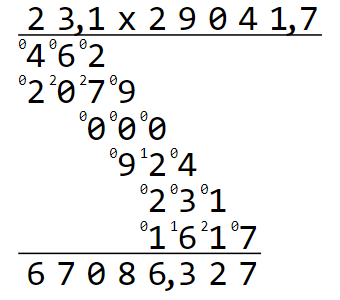

# MaMa # 

**Randomly** generate simple calculations and their solution.
Renders them on console or as printable SVG, see example below:



## Generate Random math problems for primary schools (Volksschule). ##

Type of calculation (plus, minus, multiplication, division) and many parameters concerning the random numbers and type of result can be configured in a json file.
Example below produces :
- 3 multiplications with first number between 1000 and 99999 with no comma (moveComma)
- 3 division where the result has no comma (no remainder) "Integer"
- 3 division with any result (including periodic non-periodic rational numbers)

## Documentation
[Click here for documentation: settings.md](docu/settings.md)
 
 ## Example settings.json

``` json
{
  "BasicArithmeticalOperation": {
    "multi": {
      "firstNumber": {
        "maxDigits": 5,
        "moveKomma": 0,
        "maxValue": 99999,
        "minValue": 1000,
        "allowNegative": false
      },
      "secondNumber": {
        "maxDigits": 5,
        "moveKomma": 0,
        "maxValue": 99,
        "minValue": 50,
        "allowNegative": false
      },
      "solutionCriteria": {
        "numberClass": "Integer",
        "digitsAfterCommaRange": "0",
        "allowNegative": false,
        "elementaryArithmetic": "Multiplikation"
      },
      "amount": 3
    },
    "2-stellig-Div-KeinRest": {
      "firstNumber": {
        "maxDigits": 5,
        "moveKomma": 0,
        "maxValue": 99999,
        "minValue": 500,
        "allowNegative": false
      },
      "secondNumber": {
        "maxDigits": 2,
        "moveKomma": 0,
        "maxValue": 99,
        "minValue": 12,
        "allowNegative": false
      },
      "solutionCriteria": {
        "numberClass": "Integer",
        "digitsAfterCommaRange": "0",
        "allowNegative": false,
        "elementaryArithmetic": "Division"
      },
      "amount": 3
    },
    "2-stellig-Div-MitRest": {
      "firstNumber": {
        "maxDigits": 5,
        "moveKomma": 0,
        "maxValue": 99999,
        "minValue": 500,
        "allowNegative": false
      },
      "secondNumber": {
        "maxDigits": 2,
        "moveKomma": 0,
        "maxValue": 99,
        "minValue": 12,
        "allowNegative": false
      },
      "solutionCriteria": {
        "numberClass": "Any",
        "digitsAfterCommaRange": "0",
        "allowNegative": false,
        "elementaryArithmetic": "Division"
      },
      "amount": 3
    }
  },
  "Fractions": null
}
```

## Console Output Renderer

```
C:\Temp\MaMa> .\ConsoleMath.exe -r .\Liam.json
MaMa - Mathe Maker
Load rulesSets from file: .\Liam.json
58511 x 92 = 5383012                         -                   multi
50100 x 64 = 3206400                         -                   multi
1981  x 81 = 160461                          -                   multi
86525 / 25 = 3461                            -  2-stellig-Div-KeinRest
15050 / 25 = 602                             -  2-stellig-Div-KeinRest
99358 / 47 = 2114                            -  2-stellig-Div-KeinRest
14884 / 30 = 496,13333333333333333333333333  -   2-stellig-Div-MitRest
41857 / 96 = 436,01041666666666666666666667  -   2-stellig-Div-MitRest
69944 / 37 = 1890,3783783783783783783783784  -   2-stellig-Div-MitRest
```

## Help Output ##

```
C:\Temp\MaMa> .\ConsoleMath.exe -?
ConsoleMath
  Generate Random math problems

Usage:
  ConsoleMath [options]

Options:
  --show-rules    show the content of rule sets json
  -r <r>          full path to a json config file containing the rule sets [default: RuleSets.json]
  --version       Show version information
  -?, -h, --help  Show help and usage information
 ```

 ## Links
- PdfSharpt Samples : http://www.pdfsharp.net/wiki/MigraDocSamples.ashx
- https://www.questpdf.com/ genereate PDFs